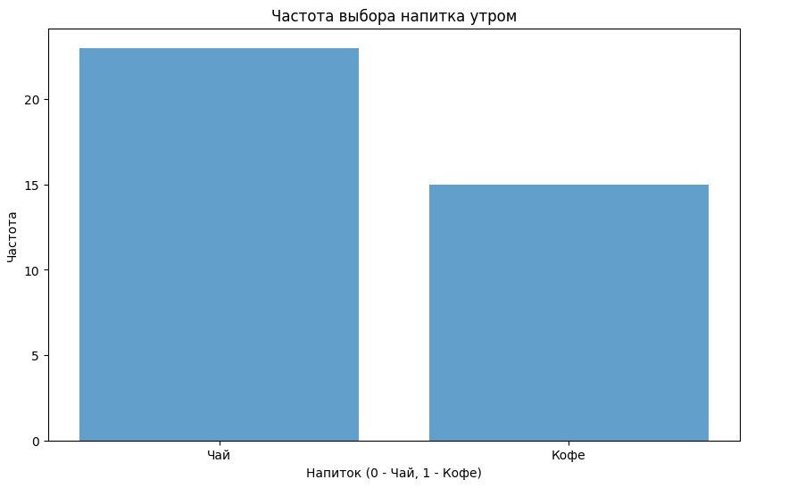
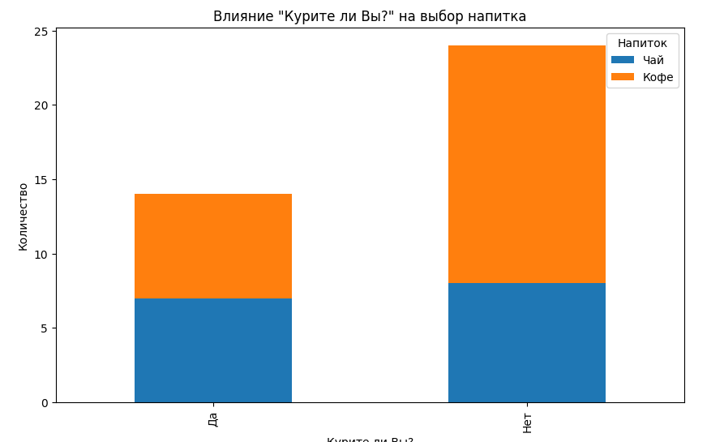
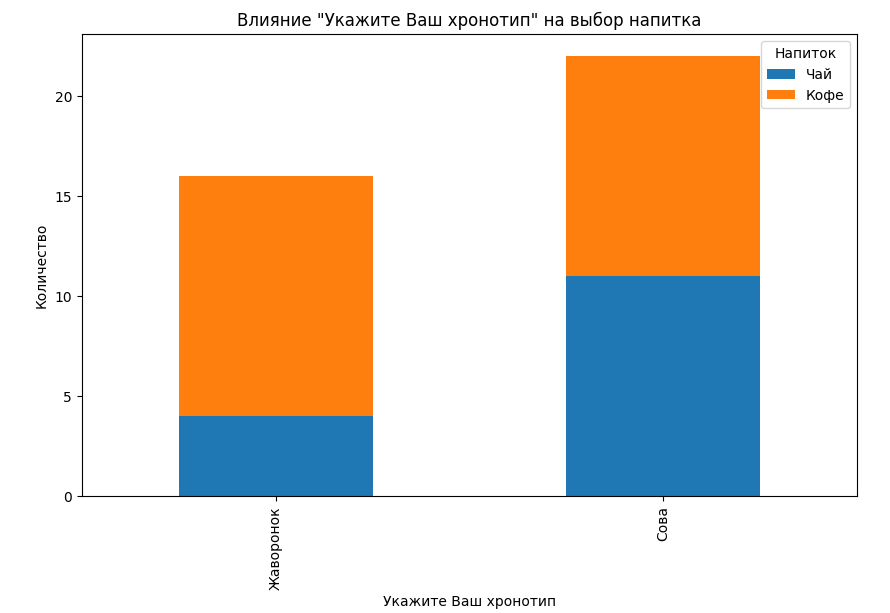

# Проект: Анализ предпочтений напитков и прогнозирование на основе опроса

## Выполняли работу 

БСМО-11-24 (Лисин С.В. Золотов А.А. Крапивин Я.С.)

## Описание проекта

Этот проект представляет собой систему, которая анализирует данные опроса с целью предсказать, какой напиток (чай или кофе) предпочитает респондент. Данные собираются через анкетирование, и на основе нескольких факторов, таких как возраст, пол, наличие кофейни поблизости и другие, с помощью алгоритма K-Nearest Neighbors (KNN) предсказывается предпочтение человека.

## Основные файлы

- **Результаты-опроса.csv**: Файл с результатами анкетирования респондентов.
- **test_data.csv**: Тестовые данные, содержащие информацию о нескольких респондентах, которые использовались для предсказания предпочтений с помощью модели.
- **KNN.py**: Основной скрипт, содержащий:
  - Алгоритм KNN для прогнозирования.
  - Код предобработки данных, включающий преобразование категориальных признаков в числовые.
  - Функции для анализа данных и визуализации влияния различных факторов на выбор напитка.

## Используемые технологии

- **Python**: Основной язык программирования для анализа и обработки данных.
- **Pandas**: Библиотека для работы с данными, загрузки и предобработки.
- **NumPy**: Используется для математических операций.
- **Matplotlib**: Библиотека для построения графиков и визуализации данных.
- **K-Nearest Neighbors (KNN)**: Алгоритм машинного обучения для классификации, используемый для прогнозирования предпочтений напитков.

## Описание задачи

Проект включает в себя следующие шаги:

1. **Сбор данных**: Данные были собраны через анкетирование, включающее такие вопросы, как "Вы курите?", "Какой Ваш хронотип?", "Вы являетесь гурманом?" и т.д.
2. **Предобработка данных**: Категориальные значения, такие как "Мужчина"/"Женщина", "Да"/"Нет" и другие, были преобразованы в числовые значения для использования в модели KNN.
3. **Обучение модели**: Обучение модели KNN на предоставленных данных с целью прогнозирования предпочтений напитков.
4. **Тестирование**: Прогнозирование предпочтений на основе новых тестовых данных.
5. **Анализ факторов**: Построение гистограмм для анализа влияния различных факторов на предпочтения напитков.
6. **Визуализация**: В проекте были созданы гистограммы для визуализации влияния факторов на выбор напитка. Это помогает лучше понять, какие факторы чаще всего влияют на предпочтение между чаем и кофе.

## Как запустить проект

1. Склонируйте репозиторий:
   ```bash
   git clone https://github.com/zol-krap-lis/pr-1.git
   ```
2. Установите необходимые зависимости:
   ```bash
   pip install numpy pandas matplotlib
   ```
3. Запустите скрипт `KNN.py` для обучения модели и визуализации данных.

## Примеры использования

- **Предсказание предпочтений**: На основе тестовых данных система предсказывает, какой напиток предпочтёт респондент — чай или кофе.
- **Анализ факторов**: Визуализация показывает, как такие факторы, как курение, хронотип, наличие кофейни рядом и другие влияют на выбор напитка.

## Заключение

Проект демонстрирует использование методов машинного обучения и анализа данных для понимания человеческих предпочтений. Он может быть расширен, чтобы включать дополнительные факторы, усложнять модель, улучшать точность прогнозирования или использовать другие алгоритмы.

### Визуализация результатов
Визуализация показывает, как такие факторы, как курение, хронотип, наличие кофейни рядом и другие влияют на выбор напитка.

- **Частота выбора напитка утром**:
  

- **Влияние курения на выбор напитка**:
  

- **Влияние хронотипа на выбор напитка**:
  

